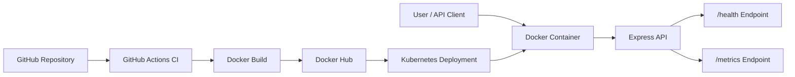
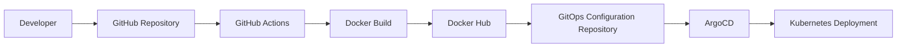

# 🚀 Sample Microservice


## 🚀 Project Overview

Sample Microservice is a production-oriented Node.js and Express API that demonstrates how a small service can be engineered for modern platform environments. The application exposes a lightweight API surface, a health endpoint for orchestration systems, and Prometheus-compatible metrics for operational visibility.

This repository is designed to show practical DevOps and cloud engineering fundamentals in one focused application:

- Application runtime implemented with Express.
- Containerized delivery using a multi-stage Docker build.
- Automated validation through GitHub Actions.
- Vulnerability scanning for source dependencies and container images.
- Kubernetes readiness through health checks, stateless runtime design, and explicit service ports.
- Prometheus metrics for observability-focused operations.

## 🏗️ Architecture Diagram



This repository represents the application layer of the broader cloud-native delivery workflow. Users and API clients interact with the Express API running inside a Docker container, while Prometheus-compatible monitoring systems scrape the `/metrics` endpoint to collect runtime and request metrics.

The application exposes a dedicated `/health` endpoint for container health checks and Kubernetes liveness/readiness probes, making it suitable for orchestrated environments.

From a delivery perspective, source code changes are validated through GitHub Actions, packaged into a Docker image, scanned for vulnerabilities, and published to Docker Hub. The resulting image can then be deployed into Kubernetes environments through the platform's GitOps deployment workflow.

## 🏗️ Application Architecture

The service follows a lightweight stateless microservice architecture designed for containerized and Kubernetes-based deployments.

Available endpoints:

* `GET /` returns application identity, version, and runtime status.
* `GET /health` returns a health response suitable for container and Kubernetes probes.
* `GET /metrics` exposes Prometheus-compatible metrics including Node.js runtime metrics and HTTP request counters.

The application starts from `src/index.js`, initializes the Express server, registers application routes, configures Prometheus instrumentation through `prom-client`, and listens on `0.0.0.0` to ensure compatibility across local development environments, containers, CI pipelines, and Kubernetes workloads.

For additional design details including runtime flow, operational characteristics, and deployment topology, see [docs/architecture.md](docs/architecture.md).

## ⚙️ Technology Stack

| Category | Implementation | Purpose |
| --- | --- | --- |
| Runtime | Node.js 18 | JavaScript service execution |
| API Framework | Express | HTTP routing and API responses |
| Metrics | prom-client / Prometheus format | Runtime and request instrumentation |
| Packaging | npm | Dependency management and scripts |
| Container Runtime | Docker | Portable application packaging |
| Base Image | Alpine Linux | Lightweight container runtime |
| CI/CD | GitHub Actions | Automated validation and image workflow |
| Security Scanning | Trivy | Filesystem and image vulnerability checks |
| Deployment Target | Kubernetes-ready container workload | Cloud-native runtime compatibility |

## 📂 Project Structure

```text
.
├── .github/workflows/ci.yml    # Build, test, scan, and container image workflow
├── Dockerfile                  # Multi-stage container image definition
├── docs/
│   └── architecture.md         # Architecture notes and operational context
├── src/
│   └── index.js                # Express application entrypoint
├── .dockerignore               # Docker build context exclusions
├── package-lock.json           # Locked dependency graph
├── package.json                # Runtime metadata and npm scripts
└── README.md                   # Project overview and operating guide
```

## 🐳 Containerization Strategy

The Dockerfile uses a multi-stage build:

- The build stage installs dependencies with `npm ci` for reproducible installs.
- The runtime stage copies only the application source, package metadata, and installed modules needed to run the service.
- The container exposes port `3000`, matching the Express default.
- Runtime startup is handled by `node src/index.js`.

The `.dockerignore` file keeps unnecessary files such as local dependencies, Git metadata, documentation, and CI configuration out of the build context. This helps keep image builds clean, repeatable, and focused on application runtime assets.

## ⚡ GitHub Actions CI Pipeline

The CI pipeline runs on pushes and pull requests targeting `main`.

Pipeline stages include:

- Checkout of repository source.
- Node.js 18 environment setup.
- Dependency installation with `npm ci`.
- Application test command execution through `npm test`.
- Trivy filesystem scanning for high and critical vulnerabilities.
- Docker image build using Docker Buildx.
- Trivy image scanning against the generated container image.
- Docker Hub publishing using repository secrets.

Image tags are generated for both the commit SHA and `latest`, supporting traceable releases and a convenient development tag.

## 🔄 Deployment Workflow



The end-to-end delivery workflow starts when a developer pushes application changes to this repository. GitHub Actions installs dependencies, runs the validation command, scans the repository filesystem, builds the Docker image, scans the image, and publishes tagged images to Docker Hub.

This repository owns the application artifact: source code, runtime dependencies, Docker packaging, CI automation, metrics exposure, and health behavior. In the larger platform architecture, the published Docker image is consumed by a separate GitOps configuration repository that defines how the service should run in Kubernetes.

The GitOps repository updates Kubernetes deployment configuration, ArgoCD watches that desired state, and Kubernetes reconciles the running workload. This separation keeps application engineering concerns in this repository while deployment configuration and environment-specific rollout logic remain in the platform configuration layer.

## 📈 Observability and Metrics

The application includes Prometheus-compatible instrumentation through `prom-client`.

Available observability features:

- Default Node.js runtime metrics.
- HTTP request counter labeled by method, route, and status.
- Dedicated `/metrics` endpoint for scraping.
- Dedicated `/health` endpoint for uptime checks and orchestration probes.

These endpoints make the service ready for common observability platforms such as Prometheus, Grafana, Kubernetes health probes, and container runtime monitoring.

## 🔒 Security Validation

Security checks are built into the CI workflow:

- Trivy filesystem scanning validates dependency and repository vulnerabilities.
- Trivy container image scanning validates the built runtime image.
- Locked dependencies through `package-lock.json` support deterministic installs.
- Docker build context exclusions reduce accidental file inclusion.
- GitHub Actions secrets are used for Docker Hub credentials.

The current pipeline reports high and critical findings without blocking the build. This makes the workflow useful for portfolio demonstration and can be tightened later by changing Trivy `exit-code` from `0` to `1`.

## 🚀 Local Development

Prerequisites:

- Node.js 18 or later.
- npm.

Install dependencies:

```bash
npm ci
```

Start the service:

```bash
npm start
```

The service listens on port `3000` by default. You can override this with the `PORT` environment variable.

Useful endpoints:

```bash
curl http://localhost:3000/
curl http://localhost:3000/health
curl http://localhost:3000/metrics
```

Run the validation command:

```bash
npm test
```

## 📦 Docker Usage

Build the image locally:

```bash
docker build -t sample-microservice:local .
```

Run the container:

```bash
docker run --rm -p 3000:3000 sample-microservice:local
```

Validate the running container:

```bash
curl http://localhost:3000/health
curl http://localhost:3000/metrics
```

## ☸️ Kubernetes Deployment Readiness

The application is designed to be straightforward to deploy as a Kubernetes workload:

- Stateless process model.
- Configurable runtime port through `PORT`.
- Container listens on `0.0.0.0`.
- `/health` endpoint can be used for liveness and readiness probes.
- `/metrics` endpoint can be scraped by Prometheus-compatible monitoring.
- Docker image is tagged by commit SHA for traceable deployments.

Recommended Kubernetes probe shape:

```yaml
livenessProbe:
  httpGet:
    path: /health
    port: 3000
readinessProbe:
  httpGet:
    path: /health
    port: 3000
```

## 📊 Project Features

- Express-based API service.
- Application metadata endpoint.
- Health check endpoint.
- Prometheus metrics endpoint.
- HTTP request counting by method, route, and response status.
- Multi-stage Docker image build.
- GitHub Actions CI pipeline.
- Filesystem and image vulnerability scanning.
- Docker Hub image publishing workflow.
- Kubernetes-oriented runtime behavior.

## 🔗 Related Repositories

This repository represents the application layer of the broader cloud-native delivery platform. The repositories below provide deployment automation, GitOps configuration, and end-to-end project documentation.

### Gitops-Platform-Config

**Repository:** https://github.com/Holuphilix/Gitops-Platform-Config

This repository contains:

* Kubernetes manifests
* Kustomize overlays
* ArgoCD Applications
* Multi-environment deployment configuration
* GitOps deployment automation

It is responsible for deploying and managing the Sample Microservice across development, staging, and production Kubernetes environments.

### Production-Grade-GitOps-Platform

**Repository:** https://github.com/Holuphilix/Production-Grade-GitOps-Platform

This repository contains:

* Project implementation documentation
* Architecture diagrams
* Validation evidence
* Platform engineering workflows
* End-to-end GitOps platform walkthroughs

It serves as the primary portfolio and project documentation repository for the complete Production-Grade GitOps Platform.

### Repository Relationship

```text
Sample-Microservice
        │
        ▼
Docker Hub Image
        │
        ▼
Gitops-Platform-Config
        │
        ▼
ArgoCD
        │
        ▼
Kubernetes Cluster
        │
        ▼
Production-Grade-GitOps-Platform
(Project Documentation & Validation)
```

This repository intentionally focuses on application development, containerization, CI automation, observability, security validation, and Kubernetes deployment readiness while the related repositories manage deployment configuration and platform documentation.

## 📚 Lessons Learned

This project demonstrates several production engineering practices that are valuable in DevOps, Cloud, and Platform Engineering roles:

- Small services should expose operational endpoints from the beginning.
- Container image design should separate build concerns from runtime concerns.
- CI pipelines should validate both source and container artifacts.
- Metrics should be treated as part of the application contract.
- Kubernetes readiness starts with application behavior, not only deployment manifests.
- A portfolio repository is stronger when documentation explains engineering intent, not only commands.

## 🏁 Conclusion

Sample Microservice shows how a compact Express API can be prepared for real deployment workflows. It combines application code, containerization, CI automation, security validation, and observability into a repository that reflects production-minded software engineering practices.

## 👨‍💻 Author

**Philip Oluwaseyi Oludolamu**

DevOps Engineer | Cloud Engineer | AWS | Kubernetes | Terraform | GitOps | CI/CD

- GitHub: https://github.com/Holuphilix
- Portfolio: https://www.philipoludolamu.com
- LinkedIn: https://www.linkedin.com/in/philip-oludolamu/

Passionate about designing scalable cloud infrastructure, implementing Infrastructure as Code (IaC), automating CI/CD pipelines, and building cloud-native platforms using modern DevOps and Platform Engineering practices.
